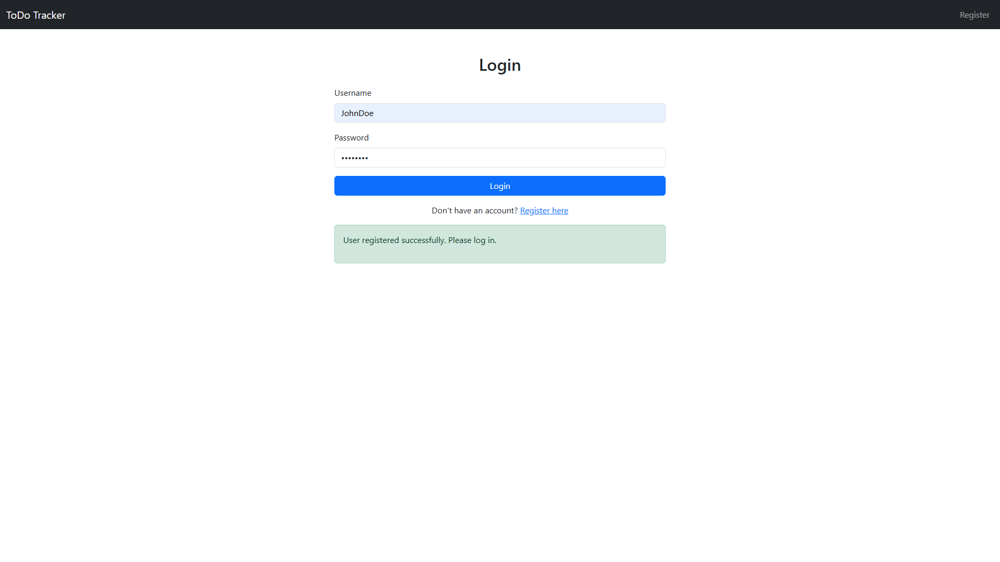
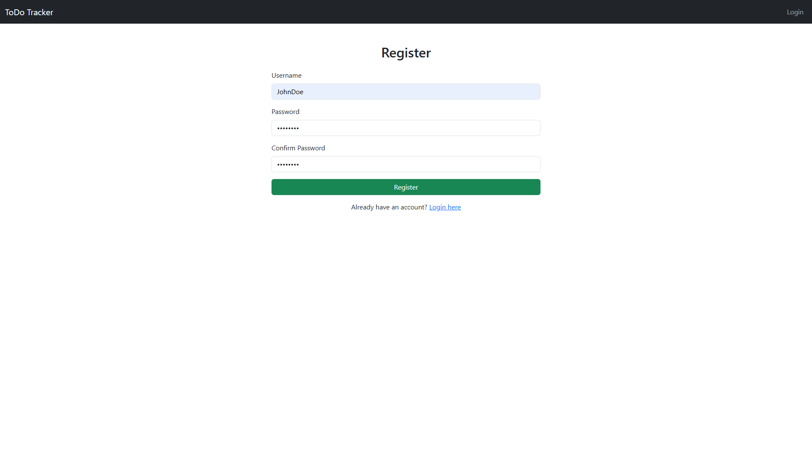
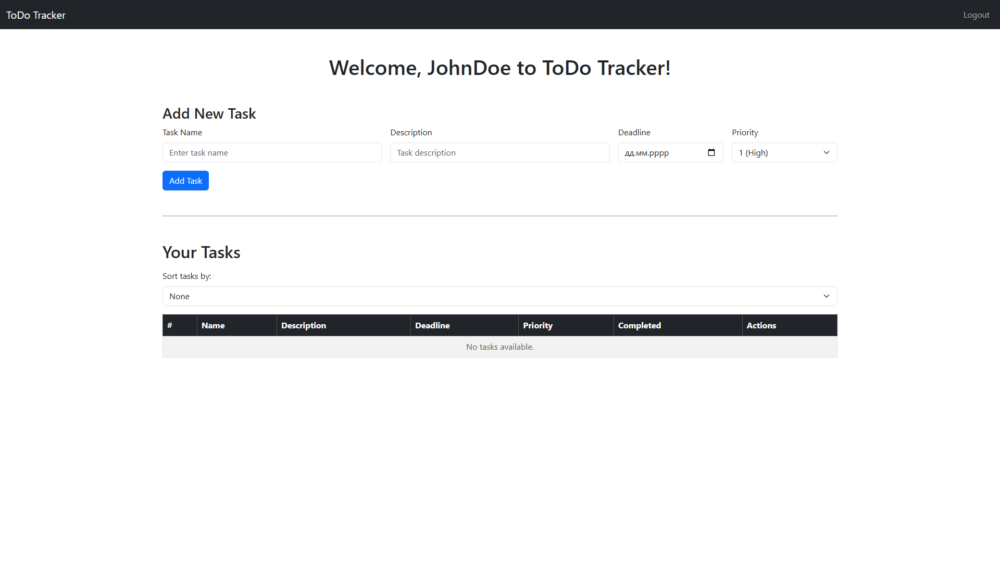
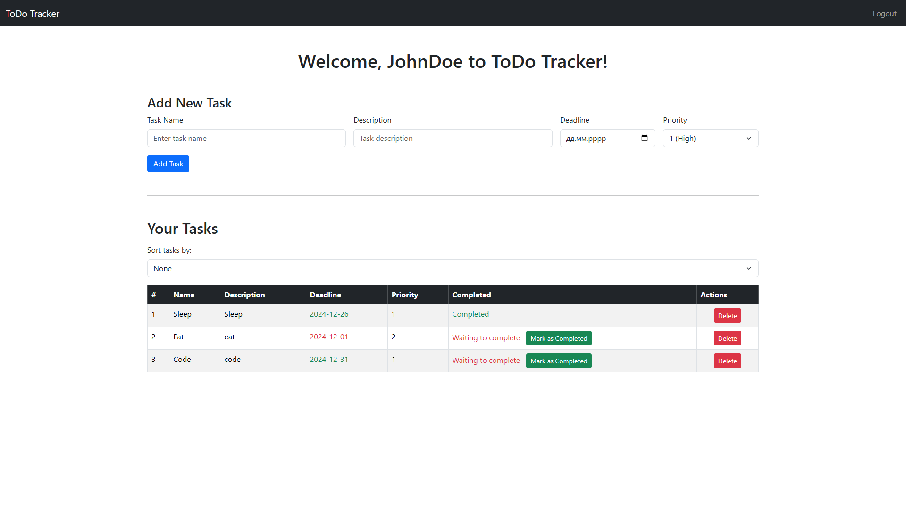

# ToDoTracker

ToDoTracker is a web task management application built on Spring Boot. Users can create tasks, set deadlines, mark tasks as completed, etc.

## Features
- User registration and authentication
- Password hashing using BCrypt
- Task creation, deletion, and marking as completed
- Task sorting by name, priority, deadline, and completion status
- Input validation with regular expressions for username and password
- Decorator pattern implemented for task creation and sorting

## Prerequisites
- Java 17 or higher
- MySQL 8 or higher
- Gradle
- A MySQL database named `todo_db`

## Technologies Used
- Spring Boot: Backend framework
- Spring Security: Authentication and authorization
- Thymeleaf: Template engine for UI
- MySQL: Database
- Hibernate: ORM framework
- BCrypt: Password hashing
- Bootstrap: Frontend framework for UI design

## Installation

### 1. Clone the repository
```bash
git clone https://github.com/jabka1/ToDoTrackerSpring
cd ToDoTrackerSpring
```

### 2. Configure the Database
Edit the application.properties file in src/main/resources:
```bash
spring.datasource.url=jdbc:mysql://localhost:3306/YOUR_DB
spring.datasource.username=YOUR_USERNAME
spring.datasource.password=YOUR_PASSWORD
spring.datasource.driver-class-name=com.mysql.cj.jdbc.Driver
```
Replace YOUR_USERNAME and YOUR_PASSWORD with your MySQL credentials.

### 3. Build the Project
Use Gradle to build the project:
```bash
gradle build
```

### 4. Run the Application
Run the application using:
```bash
gradle run
```

### 5. Access the Application
Open your browser and navigate to:
```bash
http://localhost:8080
```

## Screenshots

### 1. Login


### 2. Registration


### 3. Home
##### 1. Home page


##### 2. Home page with added tasks


<br>
